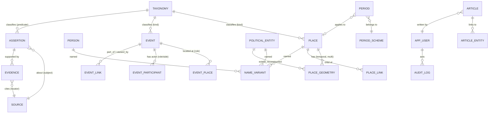

# مدل دامنه (Domain Model) و ERD

> مرجع: ADR-0003 (assertion-centric), ADR-0004 (Place/Event), ADR-0006 (names), ADR-0012 (taxonomy/periods)
> DDL قطعی در `backend/migrations/versions/` است؛ این سند «چرا و چه چیزی» را توضیح می‌دهد.

## ۱. نمودار موجودیت‌ها



## ۲. کاتالوگ جدول‌ها

### ۲.۱ هسته‌ی موجودیت‌ها

| جدول | ستون‌های کلیدی | نکته |
|------|----------------|------|
| `place` | `id, kind, status, revision, importance, rank_cache, min_zoom, year_from, year_to, precision, calendar, display_name_cache, search_text, coverage_note` | تنها موجودیت مکانی. `kind` از taxonomy |
| `person` | `id, status, revision, importance, birth_year_from/to, birth_precision, death_year_from/to, death_precision, identity_status, search_text` | قومیت/مذهب/زبان **ستون ندارند**؛ فقط assertion (ADR/قانون حساس) |
| `event` | `id, kind, status, revision, importance, year_from, year_to, precision, calendar, attestation, scale, certainty, search_text` | War/Campaign/Battle همه event با `part_of` |
| `political_entity` | `id, kind, status, revision, importance, year_from, year_to, precision, search_text, capital_place_id` | state/dynasty/emirate/khanate/order/province |
| `article` | `id, slug, status, revision, lang, title, summary, body_md, year_from, year_to, author_id, published_at, primary_entity_type/id` | presentation — منبع حقیقت نیست |
| `source` | `id, kind, title_original, title_transliterated, author, origin_year_from/to, edition, publisher, pub_year, url, doi, isbn, lang, reliability, license` | کتاب‌شناختی؛ متن کامل دارای حق نشر ذخیره نمی‌شود |

### ۲.۲ گراف و provenance (قلب سیستم)

```text
assertion(id, subject_type, subject_id, predicate, object_type, object_id,
          year_from, year_to, calendar, precision, display_text,
          confidence, status,                      -- proposed|accepted|rejected|disputed
          note, asserted_by, asserted_at, superseded_at, superseded_by, revision)

evidence(id, assertion_id, source_id, locator_type, locator,
         quote_original, quote_translation, stance,   -- supports|contradicts|qualifies
         note)
```

- `predicate` از taxonomy: `born_in, died_in, lived_in, ruled, founded, destroyed, besieged,
  located_in, contains, part_of, capital_of, member_of, built_by, commissioned_by, mentioned_in,
  participated_in, caused, succeeded, preceded, contemporary_with, attributed_to, disputed_with`.
- `subject/object` چندریختی‌اند: `(entity_type, entity_id)` با CHECK روی مقادیر مجاز.
- **projection**: ستون‌های روی entity (مثل `person.birth_place_id`) از `accepted` assertionها
  مشتق و توسط `ProjectionService` نوشته می‌شوند؛ در DB به‌صورت `*_cache`/`*_proj` نگهداری می‌شوند
  و در تست‌های invariant بررسی می‌شوند که با assertionها سازگارند.

### ۲.۳ رابطه‌های «ساختاری» (غیراختلافی)

چرا هم assertion داریم هم رابطه‌ی ساختاری؟ چون بعضی روابط **جزء هویت موجودیت‌اند** و اختلاف در آن‌ها
معنا ندارد (مثلاً `event_place`: یک نبرد کجا رخ داده — حتی اگر جای دقیق نامعلوم باشد، خودش
`certainty` دارد) در حالی که ادعاهای تفسیری (علّیت، انتساب، حکمرانی) در `assertion` می‌روند.

| جدول | نقش |
|------|-----|
| `place_link(parent, child, kind, year_from/to, source_id)` | سلسله‌مراتب مکان (contains/part_of/admin_in/historically_in) |
| `place_geometry(place, geom, kind, certainty, lod_min/max_zoom, year_from/to, source_id)` | هندسه‌ی زمان‌دار و چندگانه |
| `event_place(event, place, role, geom, certainty)` | مکان(های) رویداد با نقش |
| `event_participant(event, actor_type, actor_id, role, side)` | شرکت‌کنندگان |
| `event_link(child, parent, kind)` | part_of / caused_by / led_to |
| `article_entity(article, entity_type, entity_id, relation)` | about / mentions / related_to / primary_focus |
| `name_variant(entity_type, entity_id, lang, script, form, kind, is_preferred_for_locale, year_from/to, source_id)` | نام‌ها |
| `route_segment(route_place_id, seq, from_place_id, to_place_id, geom, year_from/to, source_id)` | مسیرها در زمان |

### ۲.۴ taxonomy و دوره‌ها

```text
taxonomy(id, kind, code, parent_code, label_fa, label_en, description, source_id, sort_order, is_active)
period_scheme(id, code, name, description, owner, source_id, is_default)
period(id, scheme_id, code, label_fa, label_en, parent_id, applies_to_place_id,
       year_from, year_to, precision, confidence, source_id)
```

### ۲.۵ editorial / identity / audit

```text
app_user(id, email, password_hash, display_name, role, status, created_at, last_login_at)
revision_snapshot(id, entity_type, entity_id, revision, payload jsonb, note, created_by, created_at)
audit_log(id, actor_id, action, entity_type, entity_id, before jsonb, after jsonb, request_id, created_at)
slug_redirect(id, entity_type, old_slug, new_slug, changed_at)
```

## ۳. قوانین ایندکس‌گذاری

| نیاز | راه‌حل |
|------|--------|
| bbox / intersects | `GiST(geom)` + `&&` قبل از `ST_Intersects` |
| هم‌پوشانی زمانی | `GiST(int4range(year_from, year_to, '[]'))` (یا `BRIN` برای داده‌ی بزرگ و مرتب) |
| جست‌وجوی متنی فارسی | `GIN(search_text gin_trgm_ops)` + `GIN(to_tsvector('simple', search_text))` |
| فیلتر `status`+`kind`+`rank` | index مرکب `(status, kind, rank_cache DESC)` + partial index `WHERE status='published'` |
| lookup سریع assertion | `(subject_type, subject_id, status)` و `(object_type, object_id, status)` |
| یکتایی نام | unique `(entity_type, entity_id, lang, script, form)` |

## ۴. Invariantها (در تست و CI)

1. `year_from <= year_to` (همه‌جا، شامل assertionها و هندسه‌ها).
2. `place_link(kind=contains)` بدون دور (acyclic) — با recursive CTE در data lint.
3. `status='published'` ⇒ حداقل یک `source` (مستقیم یا از طریق assertion/evidence).
4. `assertion.status='accepted'` ⇒ حداقل یک `evidence(stance='supports')`.
5. هر `place_geometry` باید داخل bbox حوزه‌ی مطالعه باشد مگر `kind='modern_admin'` یا flag صریح.
6. projectionها با assertionهای accepted سازگار باشند؛ تضاد ⇒ projection خالی + `disagreements` در API.
7. `name_variant` حداقل یکی با `kind='preferred'` برای هر entity منتشرشده.
8. هیچ هندسه‌ی `modern_admin` در لایه‌های تاریخی برگردانده نمی‌شود.

## ۵. نگاشت دامنه به لایه‌ی UI

| دامنه | لایه‌ی نقشه |
|-------|-------------|
| `place(kind=region/city/...)` | لایه‌ی `places` (circle/symbol) یا `regions` (fill) |
| `place(kind=building/...)` | لایه‌ی `buildings` |
| `place(kind=archaeological_site)` | لایه‌ی `archaeology` |
| `place_geometry(kind=extent_reconstructed)` | لایه‌ی `political_entities` (fill + outline با certainty style) |
| `event` | لایه‌ی `events` (symbol با آیکون نوع؛ نبردها `battles`) |
| `person` | لایه‌ی `people` (در zoom بالا، مرتبط با مکان فعال) |
| `place(kind=route)` + `route_segment` | لایه‌ی `routes` (line) |
| `place_geometry(kind=modern_admin)` | لایه‌ی `modern_borders` (نقطه‌چین، کم‌رنگ، پیش‌فرض خاموش) |
